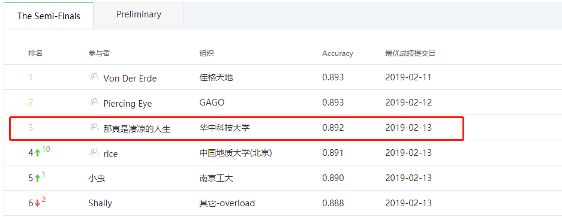
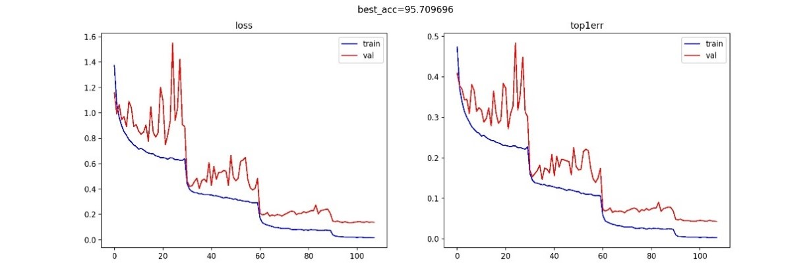

# Alibaba Cloud German AI Challenge 2018

## Introduction

This competition is an Alibaba Cloud German AI Challenge aimed for Earth Observation. [Click Here to see detailed information.](https://tianchi.aliyun.com/competition/entrance/231683/introduction?spm=5176.12281957.0.0.38b076d83CIYGw)

According to the United Nations, 68% of the world’s population is expected to live in urban areas by 2050. As cities around the world try to accommodate this enormous influx, urban planners and logisticians are faced with monumental challenges to ensure the benefits of urbanization are realized by all. With the boundaries of big data technology being expanded, the successful management of urban growth can now be assisted by the consolidation of large volumes of sensor data collected by Earth observation satellites.

In the latest Tianchi competition, contestants will try to address the urbanization challenges by using datasets of several million matched image patches from European Earth observation satellites Sentinel-1 and Sentinel-2. The datasets will include radar and multispectral sensor data, covering 42 cities. The goal of the competition is to classify the data into 17 so called local climate zones, which will help to identify solutions for urban planners. For example, the data could potentially be used for quantifying urban heat island magnitude or mapping urban terrain.

## Our Team Ranking in Semi-Finals

## Explaination of Our Code

Sinse there are five members in our team, our code is composed of two parts.

Part one contains these folders & files as follows:

- `model/`,`net/`,`npy/`,`data/`
- `config.py`,`h5datasest_onehot.py`,`h5transform.py`,`train.py`,`getProb.py`,`sampleArray.py`,`1selectData.py`,`2assembleData.py`,`3assembleDataWithProb.py`

The other part:

- `modules/`,`checkpoints`
- `config_lcz.py`,`dataloader.py`,`h5transform_lcz.py`,`predict.py`,`train_lcz.py`

Our models are placed in `checkpoints/` and `model/` folders.

To be simple, we only send you a small part of trained models, cause our whole model has 15G!

## Hardware & System Configuration

- Hardware
  - GPU: 1080Ti * 3, Alibaba Cloud PAI Platform M40 * 2
  - CPU: Intel i7 7700
  - RAM: 32G
- System & Environments
  - Ubuntu 16.04 LTS
  - Python 3.6
  - Pytorch 1.0
  - CUDA 9.2

## Requirements

`pip install -r requirements`

## Train

- make new datasets:

  - In code part one, we make new dataset for our training scheme.

  - 1selectData: select data from validation set and training set and data indices are restored in `data/idx_selected_0204_*.npy` files.

  - 2assembleData: To make full use of provided test sets, a semi-supervised knowledge distillation method is performed during semi-finals. Ensemble probability predictions on the 4 test sets (test1a, test1b, test2a and test2b) of our setting 1 and setting 2 models are used as fake labels of test data to train new single models. 

  - `python 2assembleData.py 1`, `python 2assembleData.py 2` to get dataset `training_0211_07_test4_1.h5` and `training_0211_07_test4_2.h5`

  - **Note: This process may take a while ! It depends on your machine.**

  - In code part two, run:  
  `python make_soft_labeled_dataset_lcz.py` to get `soft_2a.h5`,`soft_2b.h5`,`soft_a.h5`,`soft_b.h5` files.

- preprocess

- Augmentation: Following augmentation techniques are performed in setting 1 during training

  - Random H/V Flip

  - Random Rotate

  - Random Crop

  - Mixup training

  - | Refinement             | Top-1 |
    | ---------------------- | ----- |
    | standard               | 0.858 |
    | +H/V Flip and + Rotate | 0.865 |
    | +Random Crop           | 0.868 |
    | +Mixup training        | 0.873 |
    | +Cutout                | 0.873 |

- Networks: the following CNN networks are mainly used

  - SENet-50
  - Densenet-101(k=12)
  - Xception 
  - CBAM-50
  - ResNext-29, 32×4d

- Optimization Tool

  - Adam, SGD, etc.

- Run

  - First select your network in `net/` and `modules/`
  - `python train.py`
  - `python snapshot_train_lcz.py`

## Test

`bash quick.sh`

